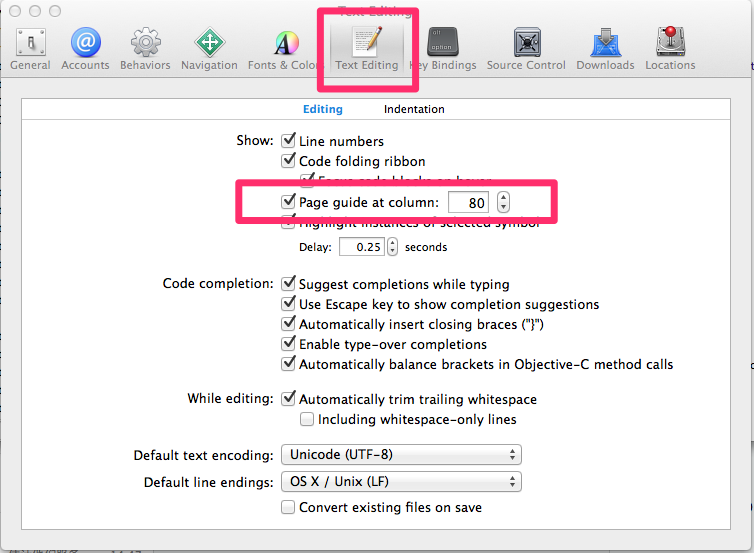

#Objective-C 编码建议

>神在细节之中

Objective-C 是 C 语言的扩展，增加了动态类型和面对对象的特性。它被设计成具有易读易用的，支持复杂的面向对象设计的编程语言。它是 Mac OS X 以及 iPhone 的主要开发语言。

Cocoa 是 Mac OS X 上主要的应用程序框架之一。它由一组 Objective-C 类组成，为快速开发出功能齐全的 Mac OS X 应用程序提供支持。

而在日常的编程中，我们除了要写代码，还需要去阅读别人的代码，熟悉过往的业务逻辑。不知，你可曾发过牢骚：这代码怎么能这么写呢？有些时候我们的代码，也会被别人去读，不知你可曾想过，当别人读到你的代码的时候会作何评价。诚然，“让代码能够工作”是做为开发者的头等大事。但是，代码的可维护性却是更加影响深远的一件事情。你的代码既有可能在下一个版本中被修改，也极有可能被交给另外的同事去修改。毕竟我们写代码，不止是在和机器沟通，而且也是在和人沟通——和其他的程序员沟通。大家都知道“学好普通话，走遍天下都不怕”，同样的道理：写出一手漂亮的代码，你和谁沟通都没问题。

即使你的原始代码修改之后，其代码风格和可读性仍会影响到可维护性和可扩展性。即使代码不复存在，你的风格和律条仍存活下来。

下面我们将围绕一些基本的准则展开讨论，目的是让我们写出一手漂亮的代码，更好的用代码与其他同事沟通，也为了提高我们代码的可维护性和可修改性，也是为了让我们自己工作的地方有一个愉悦的代码环境。

（PS：当你真的按照这些看似偏执的规则去做的时候，你就真的能够发现“伟大来自细节”，而且会受益匪浅。保剑锋自磨砺出，梅花香自苦寒来。）
##总则

1. Don't repeat your self. 
2. 代码自注释，依靠代码本身来表达你的设计意图，不要依赖注释。
3. 单一指责，无论是类、函数、模块、包尽可能令其指责纯净且单一。
4. 死程序不说谎，不要因为防止Crash写奇葩的代码。程序Crash了，反而更容易查找错误。
5. 借用美国童子军军规：让营地比你来时更干净。


##格式
1. 任意函数长度不得超过50行。
2. 任意行代码不得超过80字符。可以在设置中设置超过80个字符的提醒。  
   
3. 在定义函数的行前留白一行
4. 功能相近的代码要放在一起。
5. 使用#pragma来切分不同功能区域的代码。
6. 二元运算符和参数之间需要放置一个空格，一元运算符、强制类型转换和参数之间不放置空格。关键字之后圆括号之前需要放置一个空格.

	```
	void *ptr = &value + 10 * 3;
	NewType a = (NewType)b;
	for (int i = 0; i < 10; i++) {
	    doCoolThings();
	}
	```
7. 长的字面值应被拆分为多行。

	```
	NSArray *theShit = @[
  	  	@"Got some long string objects in here.",
		[AndSomeModelObjects too],
		@"Moar strings."
	];
	
	NSDictionary *keyedShit = @{
    	@"this.key": @"corresponds to this value",
    	@"otherKey": @"remoteData.payload",
    	@"some": @"more",
    	@"JSON": @"keys",
    	@"and": @"stuff",
	};
	```
8.


##命名
命名是编程中最基本的技能，我们给变量、函数、类、包等等命名。给他们以名字，让他们有意义，既能表示他们到底是做什么的，也能将其与其他变量区别开来。而通过，语言的发展史，我们也能够看到“方便编程人员理解和使用”一直都是编程语言发展的动力之一，而命名则是其最最核心的环节。像人一样娶一个好名字至关重要，“丁当”总比“狗蛋”来的好听。
为什么要命名？命名代表着抽象，我们使用名字将一些没必要关系的细节隐去，减少我们自己的记忆成本，也更加方便我们理解。用过C语言的人都知道，一个变量名最终会转化成类似于```0x11111111```之类的地址，相比去理解和记忆这些地址，用一个更加抽象的变量名来代表这些地址。无论从理解还是记忆上都要方便的。
###命名一定要“名副其实”，尽可能使用有意的名称，而且这个意义和指称的变量真实意义相关。

尽量不要出现没有任何意义的命名类似于下述形式的命名：

	```
	int a = 1;
	int b = 3;
	CGPoint point = CGPointMake(a,b);
	```
如果换成下面的形式是不是可读性强了很多：
	
	```
	int startX = 1;
	int startY = 3;
	CGPoint startPoint = CGPointMake(startX,startY);
	```

###命名首字母大写，其他命名首字母小写。并且采用驼峰格式分割单词。
例如：```BWTest```

###使用能够读出来的名称
人类长于记忆和使用单词。大脑中的相当一部分就是用来容纳和处理单词的。单词如果能够读的出来，则非常方便我们阅读和理解。

错误的示例：
```
genymdhms （生成日期,年、月、日、时、分、秒）
```

正确的实例：
```
generationTimeStamp
```

###使用可搜索的名称。
单字母名称和数字常量有一个问题，就是很难在一大篇文字中找出来。试想一下，你找```MAX_CLASSES_PER_STUDENT```容易还是找数字7容易。

###文件名
> 文件名反映出了其实现了什么类（包括大小写），你需要遵循所参与醒目的约定。

文件的扩展名及其意义如下：

| 扩展名 | 意义 |
|-------|----:|
| .h | C/C++/Objective-C 的头文件 |
| .m| Ojbective-C 实现文件|
| .mm| Ojbective-C++ 的实现文件|
| .c| 纯 C 的实现文件|
| .cpp| 纯 C++ 的实现文件|

####类别的扩展名以“被扩展的类名+自定义命名部分组成”
例如：
```
NSSstring+Utils.h
```
###缩略词

虽然方法命名不应使用缩略词，然而有些缩略词在过去被反复的使用，所以使用这些缩略词能更好的的表达代码的含义。下表列出了Cocoa可接受的缩略词。

| 缩略词 | 含义和备注 |
|-----|----:|
|alloc |分配，拨出 |
|alt |轮流，交替 |
|app |应用程序。比如NSApp表示全局程序对象。|
|calc | 计算 |
|dealloc |销毁、析构 |
|func | 函数 |
|horiz | 水平的 |
|info | 信息 |
|init |初始化 |
|max|最大的|
|min|最小的|
|msg|消息|
|nib|Interface Builder文档|
|pboard|黏贴板（仅对常量）|
|rect|矩形|
|temp|临时、暂时|
|vert|垂直的|

以下是一些常用的首字母缩略词：```ASCII,PDF,XML,HTML,URL,RTF,HTTP,TIFF,JPG,PNG,GIF,LZW,ROM,RGB,CMYK,MIDI,FTP...```

###宏定义全部字母大写，例如:```#define BW_DEBUG 1```
###常量定义，字符串定义以小写字母```k```开头，随后首字母大写

```
static NSString* const kBWBarTitle = @"动态";
```

###如果要定义常量使用static const优于宏定义，前者会进行类型检查


###因为OC没有命名空间的概念，所以使用前两个或者多个字母来表示命名空间，例如"NSObject中的NS"，我们也使用自己的命名空间。比如

```
红点中使用了VAS:VASAddValueInfo...
钱包中使用了QW:QWApplication....
```


##注释
###让代码自注释，不要依赖注释来解释自己的设计或者编码意图。除了特殊情况外，代码中不要有多余的注释。

##函数
###函数长度不要超过50行，小函数要比大函数可阅读性和可复用性强。
###零元函数最好，一元函数也不错，二元函数担心了，三元函数有风险，高于三元需重构。函数的参数越多，引起其变化的因素就越多。越不利于以后的修改。

不知道当你看到如下形式的函数的时候，是什么想法：

```
- (void)RequestGetLocation:(int)lat lon:(int)lon alt:(int)alt isMars:(BOOL)yn bJiejingSOSO:(BOOL)bJiejingSOSO;
```
###尽量少的写有副作用的函数
###尽量不要出现火车链式的命名，如果可以尽量使用过程变量替代。
反例例如：

```
_needLogoutAccount = [[[[BWAppSetting GetInstance] appSetting] valueForKey:NeedLogoutAccounts] retain];
```
考虑如果改成下述模样，是不是可读性一下子提高了很多：

```
BWAppSetting* shareSetting = [BWAppSetting GetInstance];
BWLockDictionary* defaultSettings = [shareSetting appSetting];
_needLogoutAccount = [[defaultSettings valueForKeyPath:NeedLogoutAccounts] retain];
```

###调用时所有参数应该在同一行

```
[myObject doFooWith:arg1 name:arg2 error:arg3];
```
或者每行一个参数，以冒号对齐：

```
[myObject doFooWith:arg1
               name:arg2
              error:arg3];
```
对于参数过多的函数，尽量使用后面一种对其方式。

不要使用下面的缩进风格：

```
[myObject doFooWith:arg1 name:arg2  // some lines with >1 arg
              error:arg3];

[myObject doFooWith:arg1
               name:arg2 error:arg3];

[myObject doFooWith:arg1
          name:arg2  // aligning keywords instead of colons
          error:arg3];
```

###如果对传入参数进行数据保护尽量不要用```if(!objc)```,使用断言来处理。

```
- (void) sendArgs:(NSDictionary*)args {
	NSAssert(args, @"args is nil");
	.....	
}
```

###方法参数名前一般使用的前缀包括“the”、“an”、“new”。

示例:

```
- (void)       setTitle:           (NSString *)   aTitle;

- (void)       setName:            (NSString *)   newName;

- (id)         keyForOption:       (CDCOption *)  anOption

- (NSArray *)  emailsForMailbox:   (CDCMailbox *) theMailbox;

- (CDCEmail *) emailForRecipients: (NSArray *)    theRecipients;
```

####Block相关
######在block中使用到self变量的时候，一定要先weak再strong.

```
__weak typeof(self) weakSelf = self;
[self doABlockOperation:^{
    __strong typeof(weakSelf) strongSelf = weakSelf;
    if (strongSelf) {
        ...
    }
}];
```

##控制结构

###顺序结构
###分支结构
####if-else结构超过四层的时候，要考虑重构。多层的ifelse结构极其难维护。
####当需要满足一定条件时才执行某项操作时，最左边缘应该是愉快路径代码。不要将愉快路径代码内嵌到if语句中。多个return是正常合理的。
良好的风格：

```
- (void) someMethod {
  if (![someOther boolValue]) {
      return;
  }
  //Do something important
}
```

反面教材：

```
- (void) someMethod {
  if ([someOther boolValue]) {
      //Do something important
  }
}
```

####所有的逻辑块必须使用花括号包围，即使条件体只需编写一行代码也必须使用花括号。

良好的风格：

```
if (!error) {
    return success;
}
```

反面教材：

```
if (!error)
    return success;
...
if (!error) return success;
```
###循环结构
####遍历可变容器之前，需要复制该容器，遍历该容器的Copy.

```
//typeof(self.cells) is NSMutableArray
NSArray* cellArrays = [self.cells copy];
for(UITableViewCell* cell in cellArrays) {
	...
}
```

###尽量不要使用异常，尤其是不要将异常做为业务逻辑的一部分，在异常中尝试进行灾难恢复。

##类与对象
###明确指定构造函数
> 注释并且明确指定你的类的构造函数。

对于需要继承你的类的人来说，明确指定构造函数十分重要。这样他们就可以只重写一个构造函数（可能是几个）来保证他们的子类的构造函数会被调用。这也有助于将来别人调试你的类时，理解初始化代码的工作流程。
###重载指定构造函数

> 当你写子类的时候，如果需要 init… 方法，记得重载父类的指定构造函数。

如果你没有重载父类的指定构造函数，你的构造函数有时可能不会被调用，这会导致非常隐秘而且难以解决的 bug。

###重载 NSObject 的方法
> 如果重载了 NSObject 类的方法，强烈建议把它们放在 @implementation 内的起始处，这也是常见的操作方法。

通常适用（但不局限）于 ```init...，copyWithZone:```，以及``` dealloc ```方法。所有 ```init... ```方法应该放在一起```，copyWithZone: ```紧随其后，最后才是``` dealloc ```方法


###初始化
####不要在 init 方法中，将成员变量初始化为 0 或者 nil；毫无必要。
现代的 Ojbective-C 代码通过调用 alloc 和 init 方法来创建并 retain 一个对象。由于类方法 new 很少使用，这使得有关内存分配的代码审查更困难。
####保持init函数简洁，不要让init函数成为千行的大函数，当超过50行的时候，适当考虑分拆一下。

良好的风格实例：

```
- (void) commonInit
{
    _rightAppendImageView = [UIImageView new];
    [self.contentView addSubview:_rightAppendImageView];
}

- (instancetype) initWithStyle:(UITableViewCellStyle)style reuseIdentifier:(NSString *)reuseIdentifier
{
    self = [super initWithStyle:style reuseIdentifier:reuseIdentifier];
    if (!self) {
        return self;
    }
    [self commonInit];
    return self;
}
```

####UIView的子类初始化的时候，不要进行任何布局操作。布局操作在LayoutSubViews里面做。
####UIView的子类布局必须在layoutSubViews里面进行，需要布局的时候调用```setNeedLayout```来告诉系统，需要重新布局该View，不要直接调用```layoutSubViews```

###保持公共 API 简单
> 保持类简单；避免 “厨房水槽（kitchen-sink）” 式的 API。如果一个函数压根没必要公开，就不要这么做。用私有类别保证公共头文件整洁。

与 C++ 不同，Objective-C 没有方法来区分公共的方法和私有的方法 – 所有的方法都是公共的（译者注：这取决于 Objective-C 运行时的方法调用的消息机制）。因此，除非客户端的代码期望使用某个方法，不要把这个方法放进公共 API 中。尽可能的避免了你不希望被调用的方法却被调用到。这包括重载父类的方法。对于内部实现所需要的方法，在实现的文件中定义一个类别，而不是把它们放进公有的头文件中。

```
// GTMFoo.m
#import "GTMFoo.h"

@interface GTMFoo (PrivateDelegateHandling)
- (NSString *)doSomethingWithDelegate;  // Declare private method
@end

@implementation GTMFoo(PrivateDelegateHandling)
...
- (NSString *)doSomethingWithDelegate {
  // Implement this method
}
...
@end
```

在OC2.0以后，你可以在实现文件中使用，类扩展来生命你的私有类别：

```
@interface GMFoo () { ... }
```


###每个文件中只创建或者实现一个类。同一个文件中不要存在多个类。
###Protocol单独用一个文件来创建。尽量不要与相关类混在一个文件中。
###类的私有变量以”_“开头。

创建私有变量，分两种情况。
第一种情况子类需要继承的，在头文件中定义：
    
    ```
    // BWTest.h
    @interface BWTest : NSObject
    {
        NSString* _name;
    }
    ```
    
第二种情况，不需要子类继承的，在实现文件中以Category的方式定义：
     ```
    // BWTest.m
    @interface BWTest ()
    {
        NSString* _name;
    }
    
    @implementation BWTest
    ...
    @end
    ```
###公有变量在一般使用属性的方法定义```@property (....) ...```

####使用委托模式，设置delegate的时候，在ARC下使用```weak```;在MRC下使用```retain```,并且在dealloc中将其指针置空。
####外部引用对象，外部不会发生set操作的对象，比如在创建界面元素的时候，使用readonly属性。
    ```
    @interface BWView : UIView
    @property (nonatomic, strong, readonly) UIView* backgoundView;
    @end
    
    @implementation BWView
    @end
    ```
    
###在类定义中使用到自己定义的类的时候，尽量不要在头文件中引入自己定义的类的同文件，使用```@class```替换。在实现文件中引入相应头文件。

例如：
```
//BWTest.h
@class BWDataCenter;
@interface BWTest : NSObject
@property (nonatomic, strong) BWDataCenter* dataCenter;
@end

//BWTest.m

#import "BWDataCenter.h"
@implementation BWTest
@end
```

###如果一个类只是DTO(data transfer object)，只是作为数据传输使用，可以不用引入使用的自定义的类的头文件，只是用```@class```，表明相应的自定义的类型。


###对于DTO类型的对象，在给其成员变量设置值的时候可以考虑使用KVC，实现下述函数：

```
- (void) setValue:(id)value forKey:(NSString *)key
{
    if ([key isEqualToString:kRedDotAppInfoPath]) {
        ....
    } else if ...
    ....
}

- (id) valueForKey:(NSString *)key {
  ....
}
```
###点标记语法
属性和幂等方法（多次调用和一次调用返回的结果相同）使用点标记语法访问，其他的情况使用方括号标记语法。
良好的风格：

```
view.backgroundColor = [UIColor orangeColor];
[UIApplication sharedApplication].delegate;
```

反面实例：

```
[view setBackgroundColor:[UIColor orangeColor]];
UIApplication.sharedApplication.delegate;
```

##Cocoa相关
###每个NSObject都有其生命周期，要在其生命周期的合适的时机做合适的事情。
例如：在初始化的时候，进行变量初始化，在销毁的时候，销毁变量等等。

###尽量不要在界面布局的写任何死数字
错误的示范：

```
 CGFloat delta = SYSTEM_VERSION >= 7.0 ? 0.0f : -14.0f;
 newFrame = CGRectMake(245 + delta,
                              (self.frame.size.height - tipNewSize.height)/2,
                              tipNewSize.width,
                              tipNewSize.height);
        
        dotFrame = CGRectMake(258.0 + delta,  (self.frame.size.height - tipDotSize.height)/2,
                              tipDotSize.width,
                              tipDotSize.height);
        
        iconFrame = CGRectMake(245 + delta,
                               (self.frame.size.height - tipIconSize.height)/2,
                               tipIconSize.width,
                               tipIconSize.height);
        numFrame = CGRectMake(245+delta, (self.frame.size.height - tipNumSize.height)/2, tipNumSize.width, tipNumSize.height);
```
正确的示范：

```
CGFloat cellHeight = CGRectGetHeight(self.frame);
CGFloat cellWidth = CGRectGetWidth(self.frame);
CGRect numFrame = CGRectZero;
numFrame.size = CGSizeMake(cellWidth,cellHeight);
...
```
###布局时尽量使用相对布局，比如使用子View在父View中的相对位置。

###在使用UITableView和UITableViewCell的时候一定要考虑到cell被复用的情况，在合适的时机对重用的cell进行清除操作。

###为UITableViewCell功能或者子View的时候有限考虑子类化。尽量不要使用在delegate中为Cell添加View。子类化，利于Cell重用和对cell内新添加的子View的布局。

良好的风格示例：

```
@interface BWSettingCell : UITableViewCell
@property (nonatomic, strong, readonly) UIImageView* rightAppendImageView;
@end

@implementation BWSettingCell

- (instancetype) initWithStyle:(UITableViewCellStyle)style reuseIdentifier:(NSString *)reuseIdentifier
{
    self = [super initWithStyle:style reuseIdentifier:reuseIdentifier];
    if (!self) {
        return self;
    }
    _rightAppendImageView = [UIImageView new];
    [self.contentView addSubview:_rightAppendImageView];
    return self;
}
- (void) layoutSubviews
{
    [super layoutSubviews];
    CGSize rightImageSize = _rightAppendImageView.image.size;
    _rightAppendImageView.frame = CGRectMake(CGRectGetWidth(self.frame) - rightImageSize.width,
                                             (CGRectGetHeight(self.frame) - rightImageSize.height) /2,
                                             rightImageSize.width,
                                             rightImageSize.height);
}
@end
```

反面教材：

```
...
- (UITableViewCell*) tableView:(UITableView *)tableView cellForRowAtIndexPath:(NSIndexPath *)indexPath
{
    static NSString* const settingCellIdentify = @"settingCellIdentify";
    UITableViewCell* cell = [self.tableView dequeueReusableCellWithIdentifier:settingCellIdentify];
    if (!cell) {
        cell = [[UITableViewCell alloc] initWithStyle:UITableViewCellStyleValue1 reuseIdentifier:settingCellIdentify];
    }
    static int kSettingCellSubViewTag = 90001;
    
    //非常错误的地方，尽量不要这样写
    [cell.contentView removeAllSubviews];
    
    UIImageView* rightAppendingView = [UIImageView new];
    rightAppendingView.image = nil;
    rightAppendingView.frame = CGRectMake(230, 8, 30, 30);
    [cell.contentView addSubview:rightAppendingView];
    return cell;
}
...
```

##设计模式相关

使用设计模式的最基本原则，除非你明确知道自己要做件什么事情，而且知道使用特定设计模式带来的影响，否则不要刻意的使用设计模式。

###单例模式
创建一个单例模式可以使用dispatch_once

```
+ (instancetype)defaultManager
{
    if (!_defaultManager) {
        static dispatch_once_t onceToken;
        dispatch_once(&onceToken, ^{
            _defaultManager = [[FlappyEggManager alloc] init];
        });
    }
    return _defaultManager;
}
```
###观察者模式
####如果只是单纯的传递数据，不要使用观察者模式，容易导致逻辑链断裂。

##抽象
##逻辑连贯性


##参考资料
1. 《[Clean Code](http://item.jd.com/10064006.html)》
2. 《[编写可阅读代码的艺术](http://item.jd.com/11020839.html)》
3. 《[Google Objective-C Style Guide](http://zh-google-styleguide.readthedocs.org/en/latest/google-objc-styleguide/)》
4. 《[Introduction to Coding Guidelines for Cocoa](https://developer.apple.com/library/mac/documentation/Cocoa/Conceptual/CodingGuidelines/CodingGuidelines.html#//apple_ref/doc/uid/10000146-SW1)》
5. 《[iOS应用开发最佳实践系列一：编写高质量的Objective-C代码](http://www.cnblogs.com/xdream86/p/3309345.html)》


##版本修订记录

|时间 | 修改内容 | 修改人 |
|-----|----:|----:|
|2014年8月27日|创建内容|stonedong|
|2015年6月26日|修改部分内容|stonedong|
